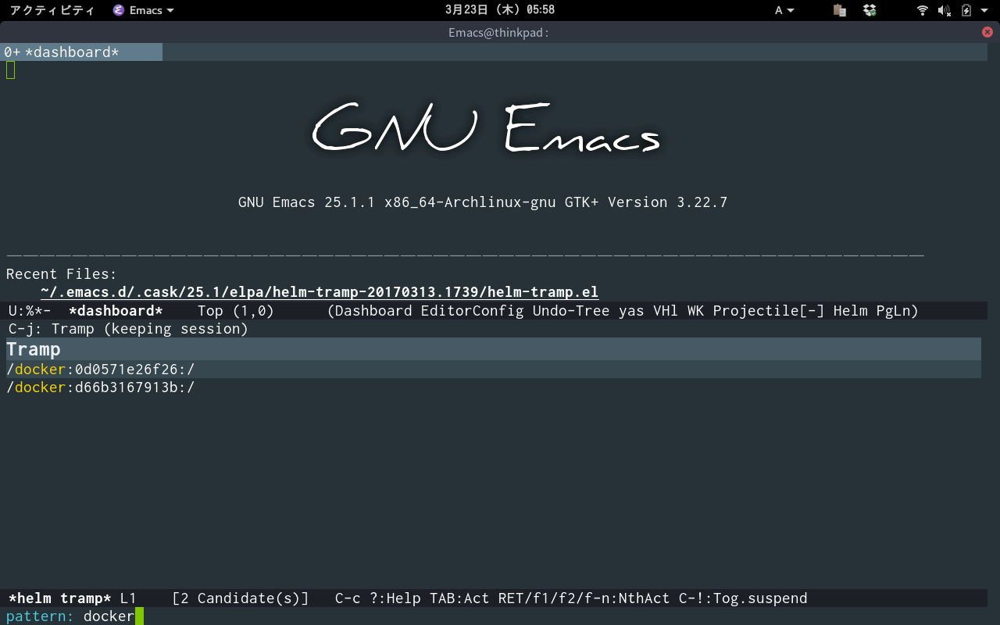
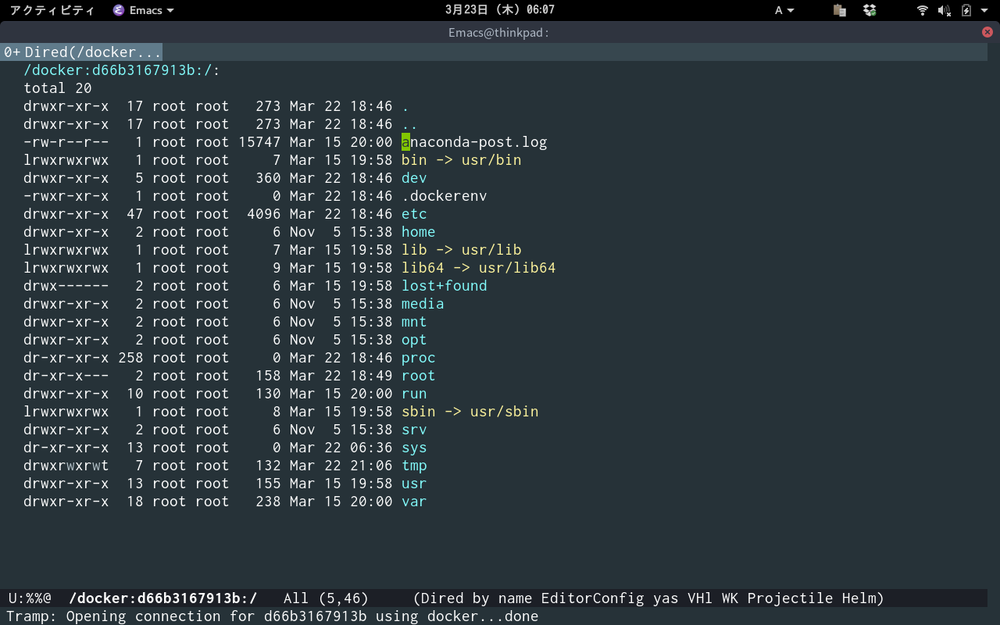

# helm-tramp [![melpa badge][melpa-badge]][melpa-link] [![melpa stable badge][melpa-stable-badge]][melpa-stable-link] [](https://www.gnu.org/licenses/gpl-3.0)

Tramp helm interface for ssh server and docker and vagrant

## Screencast


    M-x helm-tramp


Display server list from your ~/.ssh/config with helm interface.


Filter by helm.


You can connect your server with tramp.


Selecting the list with sudo will lead to the server as root.
Selecting the list of '/sudo:root@localhost:/' will open file at localhost as root.


You can edit your server's nginx.conf on your emacs!



If you are using [docker-tramp](https://github.com/emacs-pe/docker-tramp.el), docker is also supplemented.
If you are using [vagrant-tramp](https://github.com/dougm/vagrant-tramp), vagrant is also supplemented.



You can edit docker container on your emacs!

	helm-tramp-quit

When you finish editing nginx.conf you clean the tramp buffer with `helm-tramp-quit` command.

## Requirements

- Emacs 24.3 or higher
- helm 2.0 or higher

## Installation

You can install `helm-tramp.el` from [MELPA](http://melpa.org) with package.el
(`M-x package-install helm-tramp`).  
You can install `docker-tramp.el` from [MELPA](http://melpa.org) with package.el
(`M-x package-install docker-tramp`).  
If you use Emacs version >= 29.0.60 then docker-tramp is no longer necessary as this functionality is built-in to Tramp.  
You can install `vagrant-tramp.el` from [MELPA](http://melpa.org) with package.el
(`M-x package-install vagrant-tramp`).

I recommend you are going to install [exec-path-from-shell]( https://github.com/purcell/exec-path-from-shell).

## Sample Configuration

	(setq tramp-default-method "ssh")
    (define-key global-map (kbd "C-c s") 'helm-tramp)

## If you want to speed up tramp

	(add-hook 'helm-tramp-pre-command-hook '(lambda () (global-aggressive-indent-mode 0)
					     (projectile-mode 0)
					     (editorconfig-mode 0)))
	(add-hook 'helm-tramp-quit-hook '(lambda () (global-aggressive-indent-mode 1)
				      (projectile-mode 1)
				      (editorconfig-mode 1)))

Setting hook that turn off slow extensions when you execute helm-tramp.
Setting hook that turn on extensions when you execute `helm-tramp-quit` command.

If you don't make a backup files and lockfiles at remote server, it will be saved faster.

	(setq make-backup-files nil)
	(setq create-lockfiles nil)

## Misc setting

Besides ~/.ssh/config, you can add connections manually.

	(setq helm-tramp-custom-connections '(/ssh:domain|sudo:user@localhost:/))

Example when adding more than two connections manually.

	(setq helm-tramp-custom-connections '(/ssh:domain|sudo:user@localhost:/ /ssh:domain2|sudo:user@localhost:/))
	
If the shell of the server is zsh it is recommended to connect with bash.

    (eval-after-load 'tramp '(setenv "SHELL" "/bin/bash"))

If you want to specify the user name to connect with docker-tramp.

	(setq helm-tramp-docker-user "username")

If you want to specify multiple user name list to connect with docker-tramp.

	(setq helm-tramp-docker-user '("username1" "username2" "username3" "username4"))

If you want to change initial directory when connecting with /sudo:root@localhost:.

	(setq helm-tramp-localhost-directory "/root")

## Support for top-level sshconfig include

In addition to normal .ssh/config, it also supports the following format.

~/.ssh/config

    Include conf.d/work
	Include conf.d/personal

~/.ssh/conf.d/work

    Host instance
			HostName ************
			User ************
			
    Host archtest
			HostName ************
			User ************

    Host debiantest
			HostName ************
 			User ************

    Host centostest
			HostName ************
			User ************

~/.ssh/conf.d/personal

    Host myserver
			HostName ************
			User ************
			
    Host myhost
			HostName ************
			User ************

Below is not support

~/.ssh/config

    Include conf.d/**

## Support controlmaster paths

You can use it as follows.
```
(setq helm-tramp-control-master t)
```
Set ~/.ssh/config as below
```
Host *
  ControlMaster auto
  ControlPath ~/.ssh/master-%r@%h:%p
  ControlPersist 30m
  ServerAliveInterval 60
```
Execute the ssh command as follows
```
ssh ubuntu@1.1.1.1
```
~/.ssh/master-ubuntu@1.1.1.1 will be generated automatically.
Even if there is no connection setting in ~/.ssh/config, helm-tramp can complement like bellow.

	/ssh:ubuntu@1.1.1.1:
	/ssh:ubuntu@1.1.1.1|sudo:root@1.1.1.1:/

[melpa-link]: http://melpa.org/#/helm-tramp
[melpa-badge]: http://melpa.org/packages/helm-tramp-badge.svg
[melpa-stable-link]: http://stable.melpa.org/#/helm-tramp
[melpa-stable-badge]: http://stable.melpa.org/packages/helm-tramp-badge.svg
