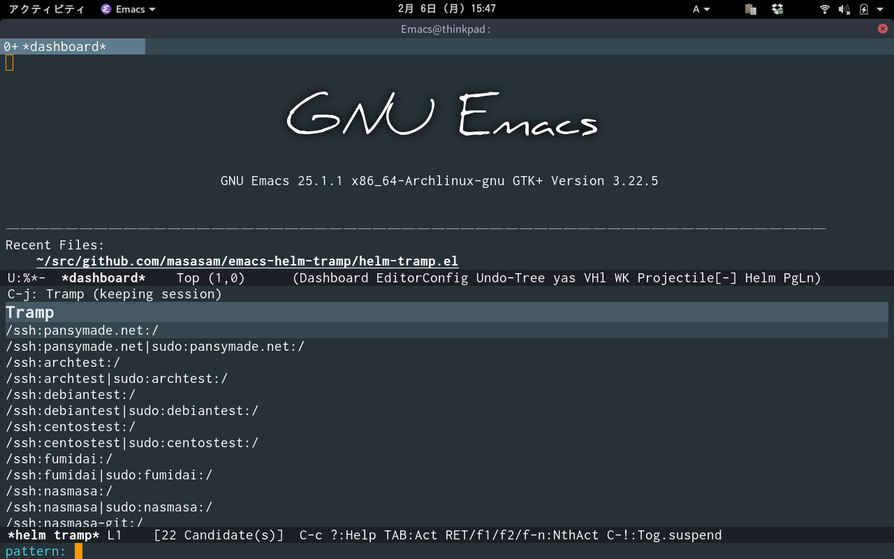
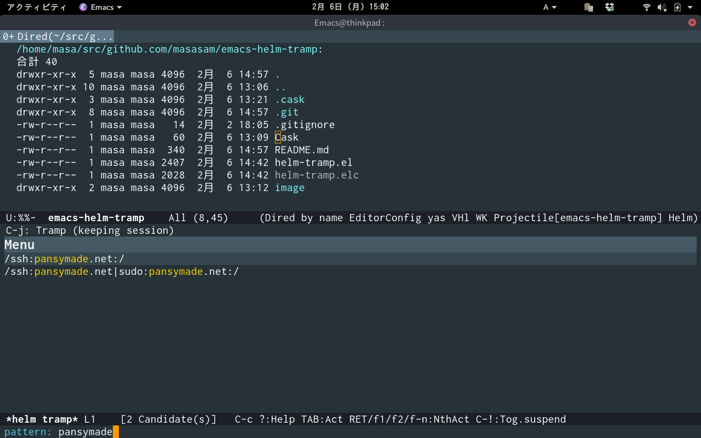
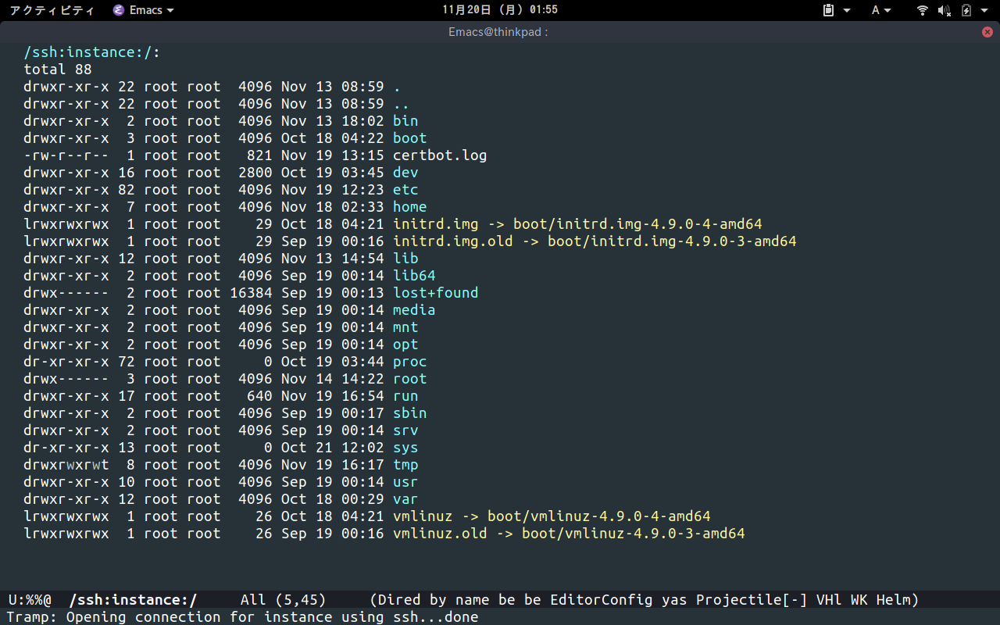
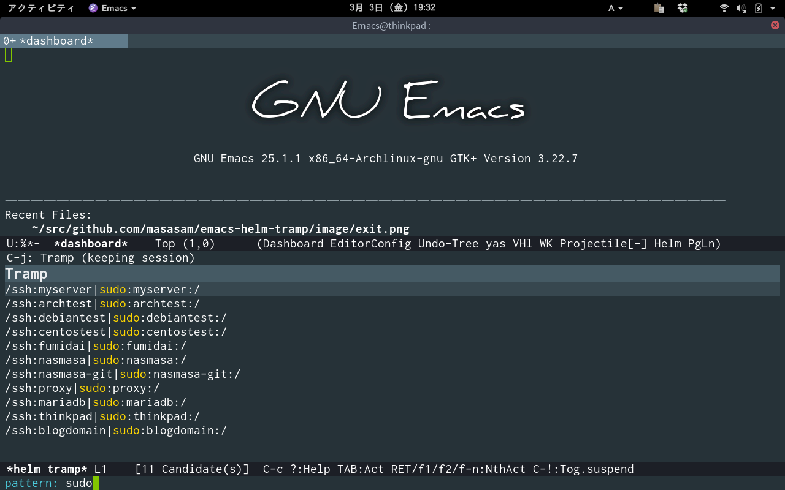
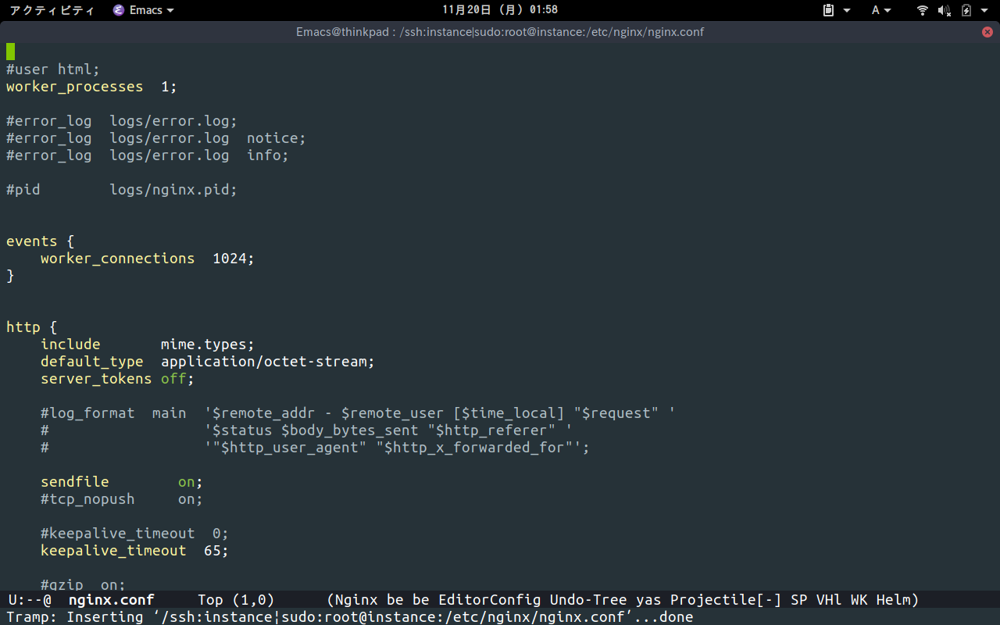
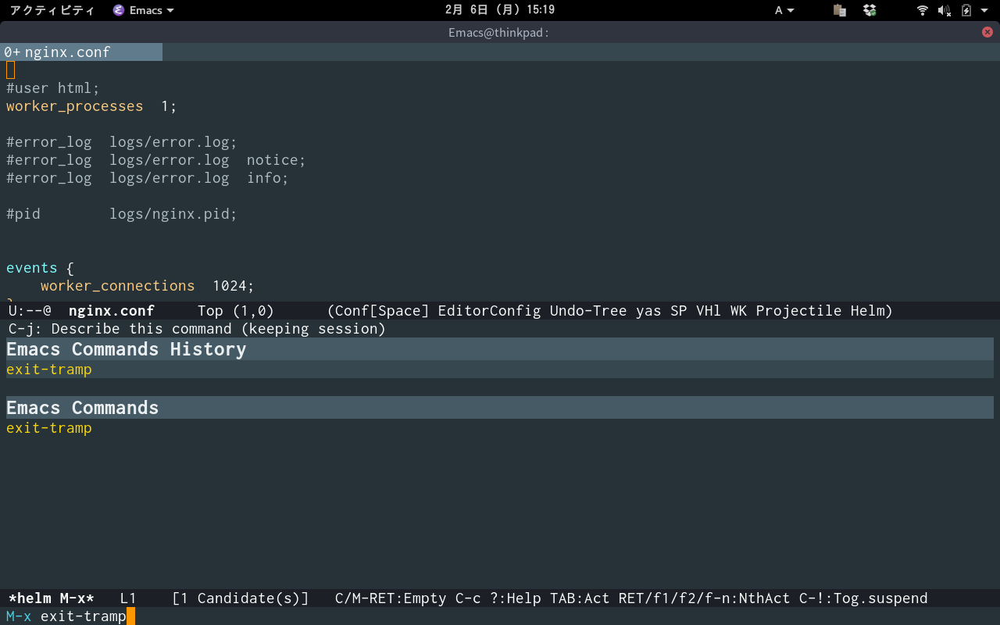

# helm-tramp

Tramp with helm interface

## Image

M-x helm-tramp  

Display server list from your ~/.ssh/config in helm  

Filter by helm  

You can connect your server with tramp  

Selecting the list with sudo will lead to the server as root  

You can edit your server's nginx.conf on your emacs!  

When you finish editing nginx.conf you clean the tramp buffer with tramp-cleanup-all-buffers.  
Since I can not remember tramp-cleanup-all-buffers I set a defalias called exit-tramp.  

## Requirements

- Emacs 24 or higher
- helm 1.7.7 or higher

## Sample Configuration

    (setq tramp-default-method "ssh")
    (defalias 'exit-tramp 'tramp-cleanup-all-buffers)
    (define-key global-map (kbd "C-c s") 'helm-tramp)
